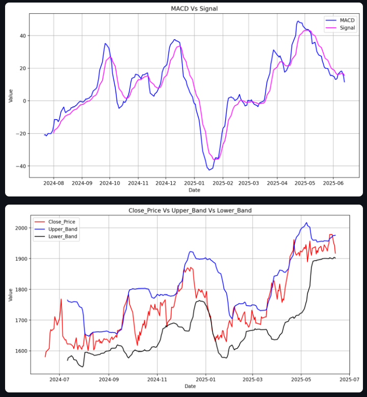

# 📈 Stock Buy/Sell Signal Engine
**Predict potential Buy/Sell signals using real-time stock data & technical indicators!**

⚠️ This project is for educational purposes only. It does not offer financial advice or guarantee accurate market predictions.

🚀 [Live Demo on Streamlit](https://stock-buy-sell-signal-engine.streamlit.app/)
👉 Enter a company name, choose the ticker, and run the signal engine to visualize!

Features

- 🔍 Search company names(Tickers) using yahooquery
- 📊 Real-time stock data via yfinance  
- 🧮 Calculation of indicators using pandas
- 📈 Technical indicators (MACD, RSI, etc.) plotted with Matplotlib 
- 🧠 Buy/Sell signal generation using 7-indicator logic  
- 🎯 Confidence percentage bars using Plotly
- 📉 Backtesting logic to simulate using past data for validation
- 🌐 Deployed using Streamlit & GitHub

📸 Screenshots

📸 Signal Output with Confidence Bars  

📊 Technical Indicator Visualizations

🔧 Installation

### Run Locally:
<pre lang="markdown"> 
bash git clone git@github.com:HemanthKumarThiruvengadam/Stock-Buy-Sell-Signal-Engine.
git cd Stock-Buy-Sell-Signal-Engine
uv venv uv pip install -r requirements.txt 
streamlit run src/main.py  
</pre>

🧠 Tech Stack

- Python
- Streamlit
- yfinance
- pandas, numpy, matplotlib, plotly
- Git & GitHub

🔍 Indicators Used

- RSI (Relative Strength Index)
- MACD & Signal line
- Moving Averages (5, 50, 200 days)
- Bollinger Bands
- Volume trends

🧪 Backtesting Logic

- Buy/Sell decisions every 7 days based on indicator signals
- Simulated portfolio starting at ₹10,000
- Evaluates profit/loss over the past 1 year

📁 Project Structure

<pre lang="markdown"> 
 📁 Stock-Buy-Sell-Signal-Engine ├── src/ │
 ├── main.py │
  ├── indicators.py │ 
  ├── signal_generator.py │
   ├── backtest.py │
    └── data_loaders.py
     ├── requirements.txt
      └── README.md 
      </pre>

🤝 Contributing

PRs and suggestions are welcome! Feel free to fork, clone, and improve the signal engine!

🧑‍💻 Author

Made by [Hemanth Kumar T](https://github.com/HemanthKumarThiruvengadam)

